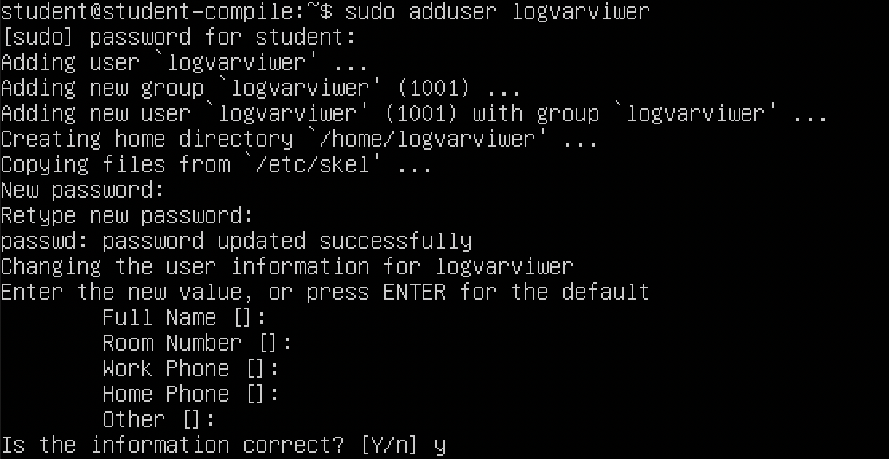
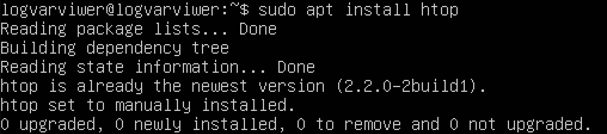
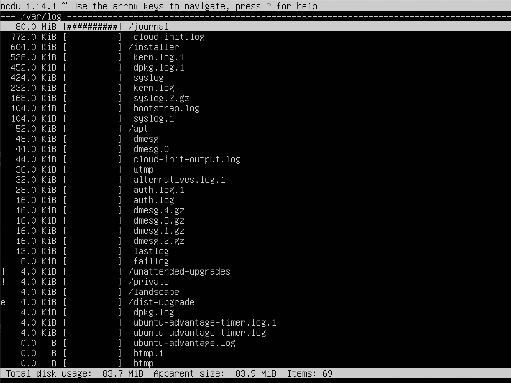

  **`D01_Linux. Установка и обновления системы Linux. Основы администрирования.`**

- [`Part 1. Установка ОС`](#part-1-установка-ос)
- [`Part 2. Создание пользователя`](#part-2-создание-пользователя)
- [`Part 3. Настройка сети ОС`](#part-3-настройка-сети-ос)
- [`Part 4. Обновление ОС`](#part-4-обновление-ос)
- [`Part 5. Использование команды sudo`](#part-5-использование-команды-sudo)
- [`Part 6. Установка и настройка службы времени`](#part-6-установка-и-настройка-службы-времени)
- [`Part 7. Установка и использование текстовых редакторов`](#part-7-установка-и-использование-текстовых-редакторов)
- [`Part 8. Установка и базовая настройка сервиса `**`SSHD`**](#part-8-установка-и-базовая-настройка-сервиса-sshd)
- [`Part 9. Установка и использование утилит` **`top`**, **`htop`**](#part-9-установка-и-использование-утилит-top-htop)
- [Part 10. Использование утилиты **fdisk**](#part-10-использование-утилиты-fdisk)
- [`Part 11. Использование утилиты` **`df`**](#part-11-использование-утилиты-df)
- [`Part 12. Использование утилиты` **`du`**](#part-12-использование-утилиты-du)
- [`Part 13. Установка и использование утилиты `**`ncdu`**](#part-13-установка-и-использование-утилиты-ncdu)
- [`Part 14. Работа с системными журналами`](#part-14-работа-с-системными-журналами)
- [`Part 15. Использование планировщика заданий` **`CRON`**](#part-15-использование-планировщика-заданий-cron)

#
## `Part 1. Установка ОС`
#


> **Задание**
> 
> `Установить` **`Ubuntu 20.04 Server LTS`** `без графического интерфейса. (Используем программу для виртуализации - VirtualBox)`

Узнать версию Ubuntu можно, выполнив команду:

```
cat /etc/issue
```


#
## `Part 2. Создание пользователя`
#


> **Задание**
> 
> `Создать пользователя, отличного от пользователя, который создавался при установке. Пользователь должен иметь разрешение на прочтение логов из папки /var/log.`

Создание пользователя осуществляется командой:

```
sudo adduser logvarviwer
```
Вызов в терминале:



Наш новый пользователь в выводе команды: 
```
cat /etc/passwd:
```


#
## `Part 3. Настройка сети ОС`
#
> **Задание**
> 
> * `Задать название машины вида user-1`
> * `Установить временную зону, соответствующую вашему текущему местоположению.`
> * `Вывести названия сетевых интерфейсов с помощью консольной команды.`
> * `В отчёте дать объяснение наличию интерфейса lo.`  
> * `Используя консольную команду получить ip адрес устройства, на котором вы работаете, от DHCP сервера.` 
> * `В отчёте дать расшифровку DHCP.`  
> *  `Определить и вывести на экран внешний ip-адрес шлюза (ip) и внутренний IP-адрес шлюза, он же ip-адрес по умолчанию (gw).` 
> * `Задать статичные (заданные вручную, а не полученные от DHCP сервера) настройки ip, gw, dns (использовать публичный DNS серверы, например 1.1.1.1 или 8.8.8.8).` 
> * `Перезагрузить виртуальную машину. Убедиться, что статичные сетевые настройки (ip, gw, dns) соответствуют заданным в предыдущем пункте.`
> * `В отчёте описать, что сделано для выполнения всех семи пунктов  (можно как текстом, так и скриншотами).`
> * `Успешно пропинговать удаленные хосты 1.1.1.1 и ya.ru и вставить в отчёт скрин с выводом команды.`

Для того чтобы изменить название машины используем команду:
```
sudo hostnamectl set-hostname logvarviwer-1
```


После перезагрузки виртуальной машины видим подтверждение, что команда отработала корректно:


Для выполнения следующего задания смотрим текущий часовой пояс c помощью утилиты:
```
timedatectl
```


 Выводим список доступных часовых поясов:
```
timedatectl list-timezones
```
В списке доступных временных зон находим нужный:


Для установления временной зоны, соответствующей нашему текущему местоположению применяем команду:

```
 timedatectl set-timezone Asia/Novosibirsk
```


Названия сетевых интерфейсов получаем и выводим по команде:
```
ip link show
```


 *`lo(loopback)`* – это петлевой интерфейс, который используется для локального доступа ко всем сетевым сервисам. Это средство межпроцессного обмена информацией только для локальных(внутренних) процессов.

Получение ip адреса устройства от DHCP сервера осуществляется командой:

```
ip route
```


 *`DHCP(Dynamic Host Configuration Protocol)`* - прикладной протокол, выполняющий всю работу по подбору сетевых настроек автоматически, без необходимости присваивать вручную каждому устройству свой IP-адрес.

Внутренний  ip адрес шлюза определяем командой и производим поиск при помощи grep:

```
ip route | grep default
```


Внешний ip адрес выводим командой:

```
curl ifconfig.me/ip
```


Средством управления сетью по умолчанию в Ubuntu является *`netplan`* 

В папке /etc/netplan находим конфигурационный файл с расширением .yaml 
```
ls /etc/netplan
```


Задать статичные настройки ip, gw, dns можно при помощи редактирования файла .yaml в виме

```
sudo vim /etc/netplan/00-installer-config.yaml
```


Режим редактирования: клавиша `i`,

Выйти из режима редактирования: `esc`,

Выйти из вим с сохранением: `wq`

Применяем изменения, чтобы при перезагрузке ВМ, внесенные нами данные сохранились

```
sudo netplan apply
```

После перезагрузки системы смотрим, что наши настройки сохранились:

```
ip a
```

Для того, чтобы успешно пропинговать удаленные хосты 1.1.1.1 и ya.ru вводим команды:
```
ping -c 5 1.1.1.1
```

```
ping -c 5 ya.ru
```


-`с` - количество пакетов, которые нужно отправить; 
#
## `Part 4. Обновление ОС`

**Задание**

> `Обновить системные пакеты до последней на момент выполнения задания версии.`  
`Узнаем, какие пакеты обновлений нам доступны, для этого обновляем репозиторий Ubuntu`

```
sudo apt update
```


Используем следующую команду для установки обновлений:

```
sudo apt upgrade
```


На скриншотах мы видим процесс выполнения вышеуказанных команд.

Проверяем, что все обновления установлены и новых больше нет.


#
## `Part 5. Использование команды sudo`
#
> **Задание**
> 
> `Разрешить пользователю, созданному в ` [Part 2](#part-2-создание-пользователя)`, выполнять команду sudo.`


Для разрешения пользователю, созданному в `Part 2` , выполнения команды sudo в командной строке пропишем:

```
sudo usermod -aG sudo logvarviwer
```


 *`Значение команды sudo:`* 
  Использование sudo позволяет выполнять привилегированные команды обычным пользователям без необходимости ввода пароля суперпользователя root. Настройки sudo позволяют реализовать гибкую систему распределения полномочий отдельных пользователей в многопользовательской среде.

 Hostname OC поменяем уже использованной нами в Part3 командой 
```
sudo hostnamectl set-hostname logvarviwer
```

Перезагружаем машину, смотрим, что шалость удалась.

#
## `Part 6. Установка и настройка службы времени`
#

> **Задание**
> 
> `Настроить службу автоматической синхронизации времени. ` 
> 
> - `Вывести время, часового пояса, в котором вы сейчас находитесь.`
> 
> - `Вывод следующей команды должен содержать NTPSynchronized=yes:  timedatectl status`
> 
>- `Вставить скрины с корректным временем и выводом команды в отчёт.`

Выводим время и текущий часовой пояс:

```
timedatectl
```


```
timedatectl show
```

#
## `Part 7. Установка и использование текстовых редакторов`
#
> **Задание**
> 
> `Установить текстовые редакторы` **`VIM`** `(+ любые два по желанию` **`NANO`**`,` **`MCEDIT`**`,` **`JOE`**` и т.д.)  `
> `Используя каждый из трех выбранных редакторов, создайте файл` *`test_X.txt`*`, где X -- название редактора, в котором создан файл. Напишите в нём свой никнейм, закройте файл с сохранением изменений.`
> - `В отчёт вставьте скриншоты:`
> - `Из каждого редактора с содержимым файла перед закрытием.`
> - `В отчёте укажите, что сделали для выхода с сохранением изменений.`
> - `Используя каждый из трех выбранных редакторов, откройте файл на редактирование, отредактируйте файл, заменив никнейм на строку "21 School 21", закройте файл без сохранения изменений.`
> - `В отчёт вставьте скриншоты:`
> - `Из каждого редактора с содержимым файла после редактирования.`
> - `В отчёте укажите, что сделали для выхода без сохранения изменений.`
> 
> `Используя каждый из трех выбранных редакторов, отредактируйте файл ещё раз (по аналогии с предыдущим пунктом), а затем освойте функции поиска по содержимому файла (слово) и замены слова на любое другое.`
> - `В отчёт вставьте скриншоты:`
> - `Из каждого редактора с результатами поиска слова.`
> - `Из каждого редактора с командами, введёнными для замены слова на другое.`

```
sudo apt install vim nano mc
```


Создаем файлы: 
```
vim test_vim.txt
```


Чтобы войти в режим редактирования - `i`

Чтобы выйти из режима редактирования - `esc`

Чтобы выйти с сохранением изменений - `:wq` и `enter`


```
nano test_nano.txt
```


Чтобы сохранить изменения - `Ctrl + O`

Чтобы выйти - `Ctrl + X`.


```
mcedit test_mcedit.txt
```

Чтобы сохранить изменения - `esc`, `F2`

Чтобы выйти - `F10`.


Убеждаемся, что файлы созданы и хранятся в директории:


Для выхода в виме без сохранения изменений: `:q!`


Для выхода в nano без сохранения изменений: `ctrl+X`, `N`


Для выхода в mcedit без сохранения изменений: `esc`, после `F10` и `No` в выборе сохранения изменений и `enter`

***Для выполнения следующего задания никнейм omarsha будет заменяться на lovepeace.***

`Для vim'а:`

Для поиска и последующей замены слова можно использовать шаблон

```
:s/search/substitution
```
 где `search` - искомое слово, а `substitution` - его замена.


 Нажимаем `enter`


`Для nano:`

Для запуска поиска в nano необходимо нажать `ctrl+\`(\ у кнопки enter), далее следовать подсказкам nano


`Для mcedit:`

Нажать `fn+F4` и далее следовать подсказкам mcedit:


#
## `Part 8. Установка и базовая настройка сервиса `**`SSHD`**
#
> **Задание**
> 
> - `Установить службу SSHd.`  
> - `Добавить автостарт службы при загрузке системы.`
> - `Перенастроить службу SSHd на порт 2022.` 
> - `Используя команду ps, показать наличие процесса sshd. Для этого к команде нужно подобрать ключи.`
> - `В отчёте объяснить значение команды и каждого ключа в ней.`
> `Перезагрузить систему.`
> - `В отчёте опишите, что сделали для выполнения всех пяти пунктов (можно как текстом, так и скриншотами).`
> - `Вывод команды netstat -tan должен содержать  \`
`tcp 0 0 0.0.0.0:2022 0.0.0.0:* LISTEN \`
`(если команды netstat нет, то ее нужно установить)`
> - `Скрин с выводом команды вставить в отчёт.`
> - `В отчёте объяснить значение ключей -tan, значение каждого столбца вывода, значение 0.0.0.0.`

Для установки службы SSHd пропишем в консоли команду:
```
sudo apt install openssh-server
```


Для добавления службы в автостарт при запуске системы используем команду:

```
sudo systemctl enable ssh.service
```


Для перенастройки службы SSHd на порт 2022 откроем конфиг службы в виме и изменяем порт:

```
sudo vim /etc/ssh/sshd_config
```


Показывать наличие запущенных процессов будем с помощью ps с флагом  -e
```
ps -e | grep ssh
```
,где `-e` -  выдает информацию обо всех запущенных процессах


Команда ps выводит список текущих процессов на сервере. Используется обычно в сочетании с командой grep и/или more или less.

Далее перезагружаем машину:

```
reboot
```


По заданию вызываем команду `netstat` с флагами
```
netstat -tan
```
Команда `netstat` выводит данные о сетевых соединениях, таблице маршрутизации, статистику сетевых интерфейсов, маскированных соединений.

Флаг `-t` - отсортировывает протокол tcp, 

`-a` - показывает прослушиваемые и непрослушиваемые порты,

`-n` - показываeт числовое представление адресов.


Значение каждого столбца:

- `Proto` - Протокол (tcp, udp, raw), используемый сокетом.
- `Recv-Q` - Счётчик байт не скопированных программой пользователя из этого сокета.
- `Send-Q` - Счётчик байтов, не подтверждённых удалённым узлом.
- `Local Address` - Адрес и номер порта локального конца сокета. Если не указана опция --numeric (-n), адрес сокета преобразуется в каноническое имя узла (FQDN), и номер порта преобразуется в соответствующее имя службы.
- `Foreign Address` - Адрес и номер порта удалённого конца сокета. Аналогично *Local Address*.
- Нулевой адрес сокета (0.0.0.0 или :::) говорит о том, что подключение отсутствует.
- `State` -  Состояние сокета. 
 *LISTEN* - Сокет ожидает входящих подключений.

*Сокет* (англ. socket — разъём) — название программного интерфейса для обеспечения обмена данными между процессами. Процессы при таком обмене могут исполняться как на одной ЭВМ, так и на различных ЭВМ, связанных между собой сетью. Сокет — абстрактный объект, представляющий конечную точку соединения.

#
## `Part 9. Установка и использование утилит` **`top`**, **`htop`**
#
 
> **Задание**
> 
> `Установить и запустить утилиты top и htop. ` 
> - `По выводу команды top определить и написать в отчёте:`
>  - `uptime`
>  - `количество авторизованных пользователей`
>  - `общую загрузку системы`
>  - `общее количество процессов`
>  - `загрузку cpu`
>  - `загрузку памяти`
>  - `pid процесса занимающего больше всего памяти`
>  - `pid процесса, занимающего больше всего процессорного времени`
> - `В отчёт вставить скрин с выводом команды htop:`
>  - `отсортированному по PID, PERCENT_CPU, PERSENT_MEM, TIME`
>  - `отфильтрованному для процесса sshd`
>  - `с процессом syslog, найденным, используя поиск`
>  - `с добавленным выводом hostname, clock и uptime` 

Утилита top уже была предустановлена на VB. Сразу запускаем

```
top
```


> - *Описание вывода команды top*:
>  - uptime - 1
>  - количество авторизованных пользователей - 1 user
>  - общая загрузку системы - 0.11 за последнюю минуту
>  - общее количество процессов - 114 шт
>  - загрузка cpu - 0.0%
>  - загрузка памяти - 198.5 used
>  - pid процесса занимающего больше всего памяти -  902
>  - pid процесса, занимающего больше всего процессорного времени - 902

Устанавливаем утилиту `htop`

```
sudo apt install htop
```


```
htop
```


Сортировать можно, используя F6, стрелки вверх-вниз и enter:

Вывод команды htop отсортированному по PID


, PERCENT_CPU:


, PERSENT_MEM:


, TIME:


Вывод команды htop отфильтрованному по sshd:


С выводом syslog, найденным через поиск:


Для вывода clock, uptime, hostname используем `fn+F2` и добавляем нужные нам характеристики.


#
## Part 10. Использование утилиты **fdisk**
#

> **Задание**
> 
> `Запустить команду fdisk -l.`


> - название жесткого диска - VBOX HARDDISK, 
> - его размер - 16 GiB,
> - количество секторов - 33554432,
> - размер swap - 1,9 GiB.

```
fdisk -l
```


```
free -h
```


#
## `Part 11. Использование утилиты` **`df`** 
#
> **Задание**
>
> `Запустить команду df. ` 
 
```
df
```


Корневой раздел (/):
  - размер раздела - 16445308 Kib,
  - размер занятого пространства - 5355420 Kib,
  - размер свободного пространства - 10234800 Kib,
  - процент использования - 35%.
- Единицы измерения -  Kib.

> Запустить команду df -Th.

```
df -Th
```
, где 

`-T` - выводит информацию о файловой системе.

`-h` - печатает размер в человекочитаемом виде.


Для корневого раздела (/):
  - размер раздела -  16 Gib,
  - размер занятого пространства -  5.2 Gib,
  - размер свободного пространства - 9.8 Gib,
  - процент использования - 35%.
  
 Тип файловой системы для раздела - `ext4`.


#
## `Part 12. Использование утилиты` **`du`**
#
> **Задание**
> 
> `Запустить команду du.`

```
du
``` 


Размер папок в байтах, в человекочитаемом виде:
```
sudo du -sh [path]
```
, где 

`s` - выводит общий размер папки.

`h` - печатает размер в человекочитаемом виде.

Папка `/home`
```
sudo du -sh /home
```


Папка `/var`
```
sudo du -sh /var
```


Папка `/var/log`

```
sudo du -sh /var/log
```


Файлы `/var/log/*`
```
sudo du -ha /var/log/* | more
```


`a` - выводит файлы.
#
## `Part 13. Установка и использование утилиты `**`ncdu`**
#

> **Задание**
> 
> `Установить утилиту ncdu.`

```
sudo apt install ncdu
```


Выводим размер папок /home, /var, /var/log
```
ncdu /home
```


```
ncdu /var
```


```
ncdu /var/log
```



#
## `Part 14. Работа с системными журналами`
#

**Задание**

> `Открыть для просмотра:` 
> 1. /var/log/dmesg
> 2. /var/log/syslog
> 3. /var/log/authlog  

```
less /var/log/dmesg
```


 
Остальные по аналогии.
Данные о последней успешной авторизации получаем через команду:
```
less /var/log/auth.log | grep -e login
```

Время последней успешной авторизации - 17:11:04,

имя пользователя - logvarviwer,

метод входа в систему - by LOGIN.

Перезапуск SSHd осуществляем командой:

```
sudo systemctl restart ssh.service
```


```
sudo tail -n 7 /var/log/syslog
```


#
## `Part 15. Использование планировщика заданий` **`CRON`**
#


> **Задание**
> 
> `Используя планировщик заданий, запустите команду uptime через каждые 2 минуты.`
> - `Найти в системных журналах строчки (минимум две в заданном временном диапазоне) о выполнении.`
> - `Вывести на экран список текущих заданий для CRON.`
> - `Вставить в отчёт скрины со строчками о выполнении и списком текущих задач.`
> 
> `Удалите все задания из планировщика заданий.`

Команда для создания или изменения существующего crontab-файла:

```
crontab -e
```

Выбираем текстовый редактор для работы с файлом из списка предложенных и добавляем uptime:


Записи о запуске задачи в системном журнале:
```
sudo tail -n 7 /var/log/syslog
```


Выполняем команду и удаляем все существующие задачи:

```
crontab -e
```


