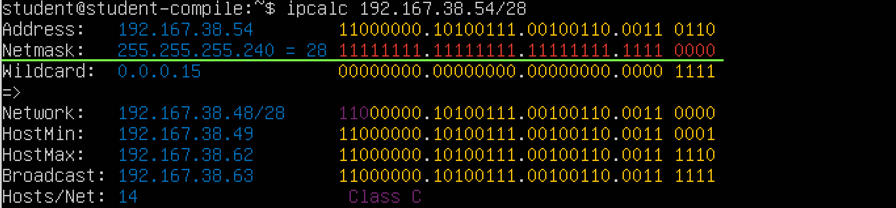
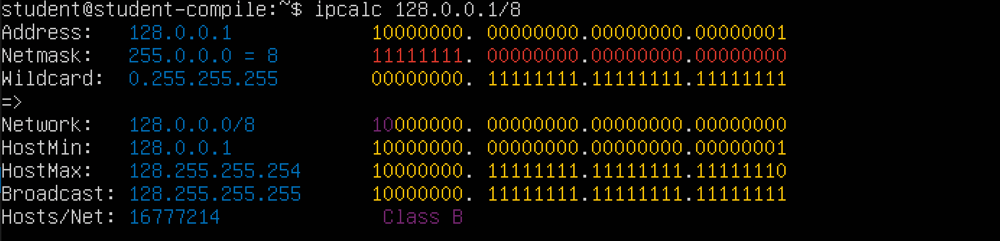
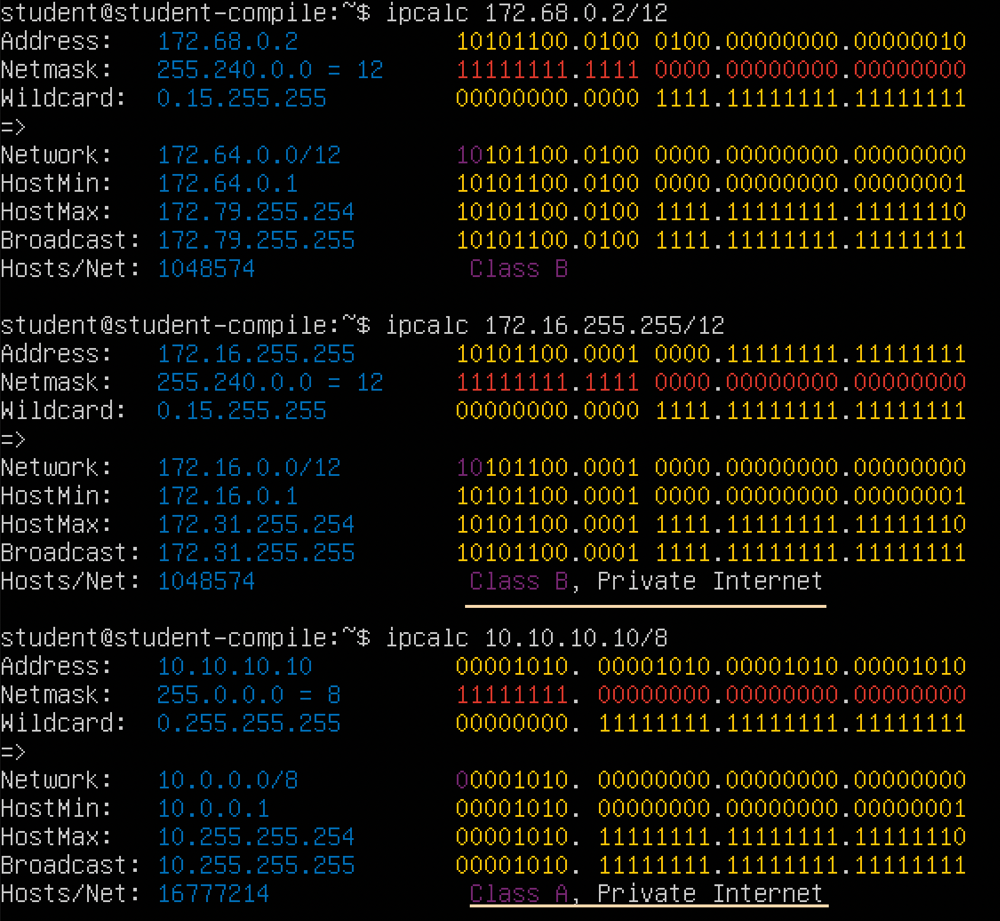
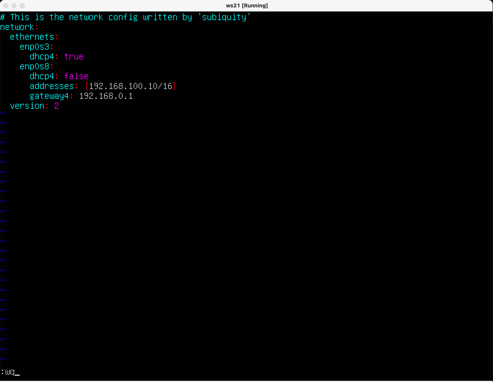
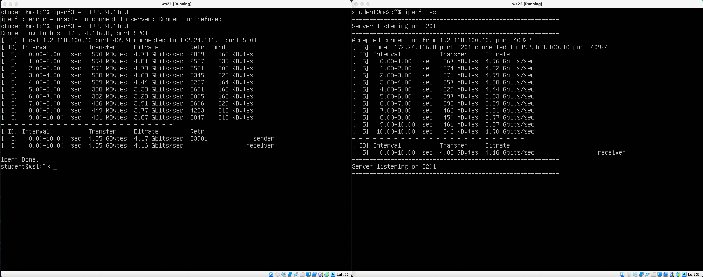
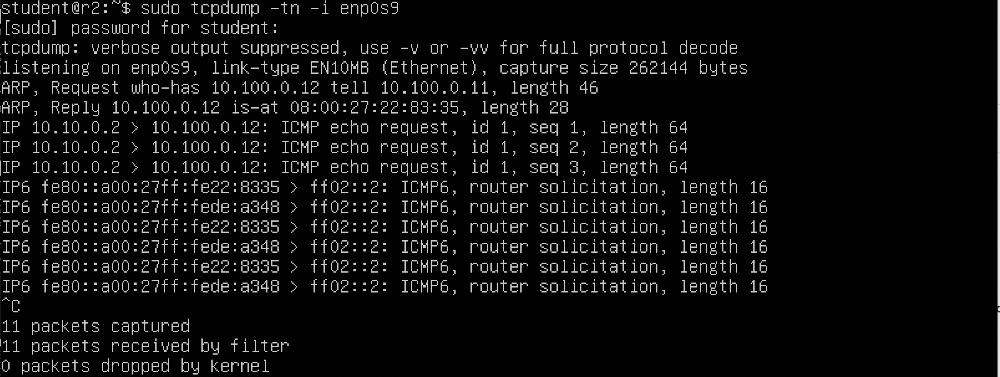
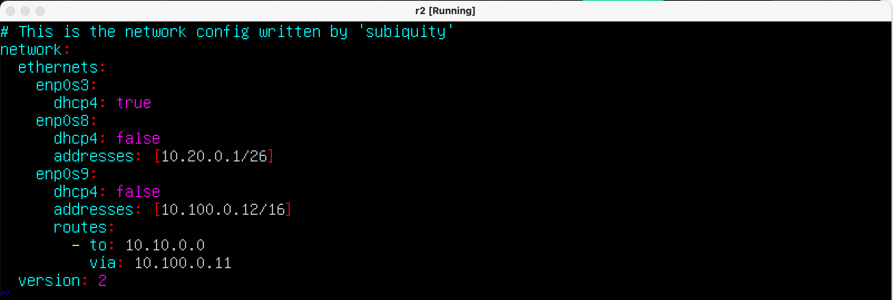
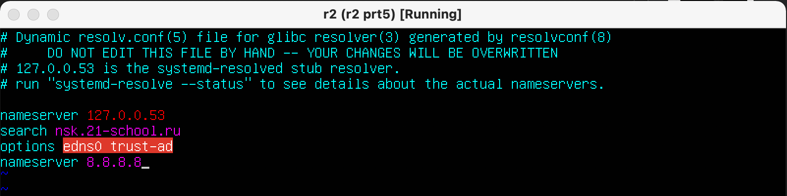
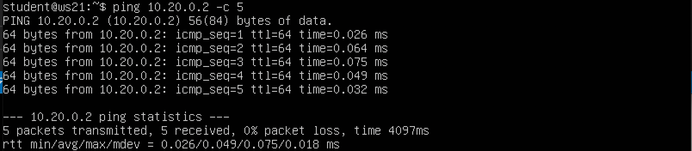

## `Сети в Linux`

## `Настройка сетей в Linux на виртуальных машинах.`


##  Содержание

   1.1. [Инструмент ipcalc](#part-1-инструмент-ipcalc) \
   1.2. [Статическая маршрутизация между двумя машинами](#part-2-статическая-маршрутизация-между-двумя-машинами) \
   1.3. [Утилита iperf3](#part-3-утилита-iperf3) \
   1.4. [Сетевой экран](#part-4-сетевой-экран) \
   1.5. [Статическая маршрутизация сети](#part-5-статическая-маршрутизация-сети) \
   1.6. [Динамическая настройка IP с помощью DHCP](#part-6-динамическая-настройка-ip-с-помощью-dhcp) \
   1.7. [NAT](#part-7-nat) \
   1.8. [Допополнительно. Знакомство с SSH Tunnels](#part-8-дополнительно-знакомство-с-ssh-tunnels)


#
## `Part 1. Инструмент` **`ipcalc`**
#

> ##### `Поднять виртуальную машину (далее -- ws1)`
#
#### `1.1. Сети и маски`
#

>##### `Определить и записать в отчёт:`
>##### `1) Адрес сети` *`192.167.38.54/13`*

Адрес сети будем определять при помощи утилиты **ipcalc**

```
ipcalc 192.167.38.54/13
```
Вывод в терминале:


Смотрим строку _Network_(на скриншоте подчеркнуто зеленым), в ней прописан искомый адрес сети.

>##### `2) Перевод маски` *`255.255.255.0`* `в префиксную и двоичную запись,` *`/15`* `в обычную и двоичную,` *`11111111.11111111.11111111.11110000`* `в обычную и префиксную`

Для перевода маски также используем утилиту ipcalc. Так как мы не можем в ipcalc прописать исключительно маску, пропишем к ip-адресу из прошлого задания необходимые нам маски(для корректной работы ipcalc)

#
`Перевод маски 255.255.255.0`:

```
ipcalc 192.167.38.54/255.255.255.0
```
Вывод в терминале для маски 255.255.255.0:


 *Двоичная*: 11111111.11111111.11111111.00000000

*Префиксная*: /24

#
`Перевод маски /15`:

```
ipcalc 192.167.38.54/15
```
Вывод в терминале для маски /15:


*Обычная*: 255.254.0.0

*Двоичная*: 11111111.1111111 0.00000000.00000000

#
`Перевод маски 11111111.11111111.11111111.11110000`:

Так как  **ipcalc** не работает с двоичными масками, используем префиксную (в двоичной маске 28 единциц, поэтому маска /28)
```
ipcalc 192.167.38.54/28
```
Вывод в терминале для маски 11111111.11111111.11111111.11110000:



*Обычная*: 255.255.255.240

*Префиксная*: /28
#

>##### `3) Минимальный и максимальный хост в сети` *`12.167.38.4`* `при масках:` *`/8`*`,` *`11111111.11111111.00000000.00000000`*`,` *`255.255.254.0`* `и` *`/4`*

#
Максимальный и минимальный хост в сети `12.167.38.4` при маске `/8`:
```
ipcalc 12.167.38.4/8
```
Вывод в терминале для `12.167.38.4/8`:


Делаем вывод, что минимальный хост - 12.0.0.1, максимальный - 12.255.255.254;
#
Максимальный и минимальный хост в сети `12.167.38.4` при маске `11111111.11111111.00000000.00000000`:
```
ipcalc 12.167.38.4/16
```
Вывод в терминале для `12.167.38.4/16`:


Делаем вывод, что минимальный хост - 12.167.0.1, максимальный - 12.167.255.254;
#
Максимальный и минимальный хост в сети `12.167.38.4` при маске `255.255.254.0`:
```
ipcalc 12.167.38.4/255.255.254.0
```
Вывод в терминале для `12.167.38.4/255.255.254.0`:


Делаем вывод, что минимальный хост - 12.167.38.1, максимальный - 12.167.39.254;
#
Максимальный и минимальный хост в сети `12.167.38.4` при маске `/4`:

```
ipcalc 12.167.38.4/4
```
Вывод в терминале для `12.167.38.4/4`:


Делаем вывод, что минимальный хост - 0.0.0.1, максимальный - 15.255.255.255;
#

#### `1.2. localhost`
#
> ##### `Определить и записать в отчёт, можно ли обратиться к приложению, работающему на localhost, со следующими IP:` *`194.34.23.100/16`*`,` *`127.0.0.2/24`*`,` *`127.1.0.1/8`*`,`*`128.0.0.1/8`*

*localhost* — в компьютерных сетях, стандартное, официально зарезервированное доменное имя для частных IP-адресов (в диапазоне 127.0.0.1 — 127.255.255.254).

Соответственно, если наш ip-адрес попадает в данный диапазон, то мы можем обратиться к приложению.


Используя всё ту же утилиту **ipcalc**, проверяем следующие IP-адреса:

```
ipcalc 194.34.23.100/16
```

```
ipcalc 127.0.0.2/24
```

```
ipcalc 127.1.0.1/8
```


```
ipcalc 128.0.0.1/8
```


На скринах видим надпись *`Loopback`*, что тоже помогает нам понять, что можем обращаться к приложению, работающему на localhost

- *194.34.23.100/16* - нет
- *127.0.0.2/24* - да
- *127.1.0.1/8* - да 
- *128.0.0.1/8* - нет

#
#### `1.3. Диапазоны и сегменты сетей`
#
> ##### `Определить и записать в отчёт:`
> ##### `1) какие из перечисленных IP можно использовать в качестве публичного, а какие только в качестве частных:` *`10.0.0.45/8`*`,` *`134.43.0.2/16`*`,` *`192.168.4.2/16`*`,` *`172.20.250.4/12`*`,` *`172.0.2.1/12`*`,` *`192.172.0.1/12`*`,` *`172.68.0.2/12`*`,` *`172.16.255.255/12`*`,` *`10.10.10.10/8`*`,` *`192.169.168.1/16`*

К частным адресам относятся IP-адреса из следующих подсетей:
- От 10.0.0.0 до 10.255.255.255 с маской 255.0.0.0 или /8
- От 172.16.0.0 до 172.31.255.255 с маской 255.240.0.0 или /12
- От 192.168.0.0 до 192.168.255.255 с маской 255.255.0.0 или /16
- От 100.64.0.0 до 100.127.255.255 с маской подсети 255.192.0.0 или /10; 

То же самое видим и в выводе ipcalc:

```
ipcalc 10.0.0.45/8
```
```
ipcalc 134.43.0.2/16
```
```
ipcalc 192.168.4.2/16
```


```
ipcalc 172.20.250.4/12
```

```
ipcalc 172.0.2.1/12
```

```
ipcalc 192.172.0.1/12
```


```
ipcalc 172.68.0.2/12
```

```
ipcalc 172.16.255.255/12
```

```
ipcalc 10.10.10.10/8
```


```
ipcalc 192.169.168.1/16
```


К частным адресам из списка относятся:
- 10.0.0.45/8
- 192.168.4.2/16
- 172.20.250.4/12
- 172.16.255.255/12
- 10.10.10.10/8

К публичным адресам из списка относятся:
- 134.43.0.2/16
- 172.0.2.1/12
- 192.172.0.1/12
- 172.68.0.2/12
- 192.169.168.1/16


> ##### `2) какие из перечисленных IP адресов шлюза возможны у сети` *`10.10.0.0/18`*`:` *`10.0.0.1`*`,` *`10.10.0.2`*`,` *`10.10.10.10`*`,` *`10.10.100.1`*`,` *`10.10.1.255`*

Аналогично предыдущим пунктам задания вводим сеть в `ipcalc`:

```
ipcalc 10.10.0.0/18
```


Из перечисленных IP адресов шлюза у сети 10.10.0.0/18 возможны:
- 10.10.0.2
- 10.10.10.10
- 10.10.1.255
  
Не возможны:
- 10.0.0.1
- 10.10.100.1

#
## `Part 2. Статическая маршрутизация между двумя машинами`
#

>**Задание**
> ##### `Поднять две виртуальные машины (далее -- ws1 и ws2)`
>##### `С помощью команды `**ip a**` посмотреть существующие сетевые интерфейсы`

В настройках виртуал бокс прописываем второму адаптеру значение "Внутренняя сеть" для обеих машин:


- `В отчёт поместить скрин с вызовом и выводом использованной команды.`

По заданию в командной строке пишем 
```
ip a
```
и делаем скриншоты вывода для первой и второй машин:


##### `Описать сетевой интерфейс, соответствующий внутренней сети, на обеих машинах и задать следующие адреса и маски: ws1 - `*`192.168.100.10`*`, маска `*`/16`*`, ws2 - `*`172.24.116.8`*`, маска `*`/12`*

- В отчёт поместить скрины с содержанием изменённого файла *etc/netplan/00-installer-config.yaml* для каждой машины.




##### Выполнить команду `netplan apply` для перезапуска сервиса сети
- `В отчёт поместить скрин с вызовом и выводом использованной команды.`


#### `2.1. Добавление статического маршрута вручную`
##### `Добавить статический маршрут от одной машины до другой и обратно при помощи команды вида ip r add`
##### `Пропинговать соединение между машинами`
- `В отчёт поместить скрин с вызовом и выводом использованных команд.`


#### `2.2. Добавление статического маршрута с сохранением`
##### `Перезапустить машины`
##### `Добавить статический маршрут от одной машины до другой с помощью файла `*`etc/netplan/00-installer-config.yaml`*
- `В отчёт поместить скрин с содержанием изменённого файла` *`etc/netplan/00-installer-config.yaml`*`.`


##### `Пропинговать соединение между машинами`
- `В отчёт поместить скрин с вызовом и выводом использованной команды.`


#
## `Part 3. Утилита` **`iperf3`**
#
>**Задание**

*В данном задании используются виртуальные машины ws1 и ws2 из Части 2*

#### `3.1. Скорость соединения`
##### `Перевести и записать в отчёт: 8 Mbps в MB/s, 100 MB/s в Kbps, 1 Gbps в Mbps`

- 8 Mbps(мегабит/сек) в MB/s(мегабайт/сек) =  1 MB/s
- 100 MB/s в Kbps =  819200  Kbps
- 1 Gbps в Mbps = 1024 Mbps

#### `3.2. Утилита` **`iperf3`**
##### `Измерить скорость соединения между ws1 и ws2`

- `В отчёт поместить скрины с вызовом и выводом использованных команд.`

Утилита `iperf` - это генератор сетевого трафика, предназначенный для проверки скорости и пропускной способности сети.

Измерять скорость соединения между машинами будем при помощи ввода в командную строку последовательно:

Для ws2 (в роли сервера):
```
iperf3 -s
```
Для ws1 (в роли клиента):
```
iperf3 -c 172.24.116.8
```


#
## `Part 4. Сетевой экран`
#

**Задание**

*В данном задании используются виртуальные машины ws1 и ws2 из Части 2*

#### `4.1. Утилита` **`iptables`**
##### `Создать файл` *`/etc/firewall.sh`*`, имитирующий фаерволл, на ws1 и ws2:`
```
#!/bin/sh

# Удаление всех правил в таблице "filter" (по-умолчанию).
iptables –F
iptables -X
```

Для этого в консоли пропишем для обеих машин:
```
sudo vim /etc/firewall.sh
```


##### `Нужно добавить в файл подряд следующие правила:`
##### `1) на ws1 применить стратегию когда в начале пишется запрещающее правило, а в конце пишется разрешающее правило (это касается пунктов 4 и 5)`
##### `2) на ws2 применить стратегию когда в начале пишется разрешающее правило, а в конце пишется запрещающее правило (это касается пунктов 4 и 5)`
##### `3) открыть на машинах доступ для порта 22 (ssh) и порта 80 (http)`
##### `4) запретить` *`echo reply`* `(машина не должна "пинговаться”)`
##### `5) разрешить `*`echo reply`*` (машина должна "пинговаться")`
- `В отчёт поместить скрины с содержанием файла` *`/etc/firewall`*` для каждой машины.`


*Input* - обрабатывает входящие пакеты и подключения. Например, если какой-либо внешний пользователь пытается подключиться к вашему компьютеру по ssh или любой веб-сайт отправит вам свой контент по запросу браузера. Все эти пакеты попадут в эту цепочку;

*Output* - эта цепочка используется для исходящих пакетов и соединений. Сюда попадают пакеты, которые были созданы при попытке выполнить ping ya.ru или когда вы запускаете браузер и пытаетесь открыть любой сайт.

*ACCEPT* - разрешить прохождение пакета дальше по цепочке правил;

*DROP* - удалить пакет;

-A - добавить правило в конец таблицы правил;

Дополнительные опции:

-p - указать протокол, один из tcp, udp, udplite, icmp, icmpv6,esp, ah, sctp, mh;

-j - выбрать действие, если правило подошло.

##### `Запустить файлы на обеих машинах командами chmod +x /etc/firewall.sh и /etc/firewall.sh`
- `В отчёт поместить скрины с запуском обоих файлов.`

```
sudo chmod +x /etc/firewall.sh
```

```
sudo sh /etc/firewall.sh
```

```
sudo iptables -L
```


- `В отчёте описать разницу между стратегиями, применёнными в первом и втором файлах.`

Правила применяются последовательно.
Но, после того, как правило "сработало", оно не может быть перезаписано другим. Соответственно, на ws1 будет активно запрещающее правило, на ws2 будет активно разрешающее.

#### `4.2. Утилита `**`nmap`**
##### `Командой `**`ping`** `найти машину, которая не "пингуется", после чего утилитой` **`nmap`** `показать, что хост машины запущен`
*Проверка: в выводе nmap должно быть сказано: `Host is up`*
- `В отчёт поместить скрины с вызовом и выводом использованных команд `**`ping`** `и` **`nmap`**`.`
  


##### `Сохранить дампы образов виртуальных машин`

В Менеджере VM нажимаем на кнопку и выбираем из списка "снимок":


Таким образом делаем 


#
## `Part 5. Статическая маршрутизация сети`
#

**Задание**

##### `Поднять пять виртуальных машин (3 рабочие станции (ws11, ws21, ws22) и 2 роутера (r1, r2))`


#
#### `5.1. Настройка адресов машин`
#
##### `Настроить конфигурации машин в` *`etc/netplan/00-installer-config.yaml`*` согласно сети на рисунке.`

- `В отчёт поместить скрины с содержанием файла `*`etc/netplan/00-installer-config.yaml`* `для каждой машины.`

Настройка 


##### `Перезапустить сервис сети. Если ошибок нет, то командой ip -4 a проверить, что адрес машины задан верно. Также пропинговать ws22 с ws21. Аналогично пропинговать r1 с ws11.`
- `В отчёт поместить скрины с вызовом и выводом использованных команд.
Сервис сети для каждой машины перезапускаем при помощи команды: `

```
sudo netplan apply
```


Далее по заданию вызываем команду `ip -4 a` для каждой из машин:

Для ws11:

Для ws21:

Для ws22:

Для r1:

Для r2:


Пропингуем ws21 с ws22:


И наоборот:


Далее пингуем r1 с ws11:


И, наоборот:


#
#### `5.2. Включение переадресации IP-адресов.`
#
##### `Для включения переадресации IP, выполните команду на роутерах:`
```
sysctl -w net.ipv4.ip_forward=1
```

*`При таком подходе переадресация не будет работать после перезагрузки системы.`*
- `В отчёт поместить скрин с вызовом и выводом использованной команды.`


##### `Откройте файл` *`/etc/sysctl.conf`*` и добавьте в него следующую строку:`
**`net.ipv4.ip_forward = 1`**

*`При использовании этого подхода, IP-переадресация включена на постоянной основе.`*
- `В отчёт поместить скрин с содержанием изменённого файла `*`/etc/sysctl.conf`*`.`


#
#### `5.3. Установка маршрута по-умолчанию`
#
Пример вывода команды `ip r` после добавления шлюза:
```
default via 10.10.0.1 dev eth0
10.10.0.0/18 dev eth0 proto kernel scope link src 10.10.0.2
```
##### `Настроить маршрут по-умолчанию (шлюз) для рабочих станций. Для этого добавить gateway4 \[ip роутера\] в файле конфигураций`

- `В отчёт поместить скрин с содержанием файла` *`etc/netplan/00-installer-config.yaml`*`.`

Скриншот с содержанием файла 00-installer-config.yaml машины ws11: 


Скриншот с содержанием файла 00-installer-config.yaml машины ws21: 


Скриншот с содержанием файла 00-installer-config.yaml машины ws22: 


##### `Вызвать` **ip r** `и показать, что добавился маршрут в таблицу маршрутизации`

- `В отчёт поместить скрин с вызовом и выводом использованной команды.`


Вызов команды `ip r` для ws11: 


Вызов команды `ip r` для ws21: 


Вызов команды `ip r` для ws22: 


##### `Пропинговать с ws11 роутер r2 и показать на r2, что пинг доходит. Для этого использовать команду:`
*`tcpdump -tn -i eth1`*
- `В отчёт поместить скрин с вызовом и выводом использованных команд.`

На роутере r2 вызываем команду tcpdump, также видим, что ping с ws11 доходит:



C машины ws11 пингуем r2:


#
#### `5.4. Добавление статических маршрутов`
#
##### `Добавить в роутеры r1 и r2 статические маршруты в файле конфигураций. Пример для r1 маршрута в сетку 10.20.0.0/26:`
```shell
# Добавить в конец описания сетевого интерфейса eth1:
- to: 10.20.0.0
  via: 10.100.0.12
```

- `В отчёт поместить скрины с содержанием изменённого файла` *`etc/netplan/00-installer-config.yaml`* `для каждого роутера.`


Добавляем в конец описания сетевого интерфейса enp0s9 для роутера r1:


Добавляем в конец описания сетевого интерфейса enp0s8 для роутера r1:




##### `Вызвать` **`ip r`** `и показать таблицы с маршрутами на обоих роутерах. Пример таблицы на r1:`
```
10.100.0.0/16 dev eth1 proto kernel scope link src 10.100.0.11
10.20.0.0/26 via 10.100.0.12 dev eth1
10.10.0.0/18 dev eth0 proto kernel scope link src 10.10.0.1
```
- `В отчёт поместить скрин с вызовом и выводом использованной команды.`


##### `Запустить команды на ws11:`
`ip r list 10.10.0.0/[маска сети]` и `ip r list 0.0.0.0/0`
- `В отчёт поместить скрин с вызовом и выводом использованных команд.`


- `В отчёте объяснить, почему для адреса 10.10.0.0/\[порт сети\] был выбран маршрут, отличный от 0.0.0.0/0, хотя он попадает под маршрут по-умолчанию.`

Для адреса 10.10.10.10/18 был выбран маршрут, отличный от 0.0.0.0/0, потому что роутер выбирает адрес с наибольшей маской, так как это наиболее надежное решение.

#
#### `5.5. Построение списка маршрутизаторов`
#
`Пример вывода утилиты` **`traceroute`** `после добавления шлюза:`
```
1 10.10.0.1 0 ms 1 ms 0 ms
2 10.100.0.12 1 ms 0 ms 1 ms
3 10.20.0.10 12 ms 1 ms 3 ms
```
##### `Запустить на r1 команду дампа:`
```
tcpdump -tnv -i eth0
```

##### `При помощи утилиты` **`traceroute`** `построить список маршрутизаторов на пути от ws11 до ws21`

- `В отчёт поместить скрины с вызовом и выводом использованных команд (tcpdump и traceroute).`


- `В отчёте, опираясь на вывод, полученный из дампа на r1, объяснить принцип работы построения пути при помощи` **`traceroute`**`.`

> Для определения промежуточных маршрутизаторов traceroute отправляет целевому узлу серию ICMP-пакетов (по умолчанию 3 пакета), с каждым шагом увеличивая значение поля TTL («время жизни») на 1. Это поле обычно указывает максимальное количество маршрутизаторов, которое может быть пройдено пакетом. Первая серия пакетов отправляется с TTL, равным 1, и поэтому первый же маршрутизатор возвращает обратно ICMP-сообщение «time exceeded in transit», указывающее на невозможность доставки данных. Traceroute фиксирует адрес маршрутизатора, а также время между отправкой пакета и получением ответа (эти сведения выводятся на монитор компьютера). Затем traceroute повторяет отправку серии пакетов, но уже с TTL, равным 2, что заставляет первый маршрутизатор уменьшить TTL пакетов на единицу и направить их ко второму маршрутизатору. Второй маршрутизатор, получив пакеты с TTL=1, так же возвращает «time exceeded in transit». Процесс повторяется до тех пор, пока пакет не достигнет целевого узла. При получении ответа от этого узла процесс трассировки считается завершённым.

#
#### `5.6. Использование протокола` **`ICMP`** `при маршрутизации`
#
##### `Запустить на r1 перехват сетевого трафика, проходящего через eth0 с помощью команды:`
`tcpdump -n -i eth0 icmp`

```
tcpdump -n -i enp0s8 icmp
```

##### `Пропинговать с ws11 несуществующий IP (например, *10.30.0.111*) с помощью команды:`
`ping -c 1 10.30.0.111`
- `В отчёт поместить скрин с вызовом и выводом использованных команд.`


##### `Сохранить дампы образов виртуальных машин`
#
## `Part 6. Динамическая настройка IP с помощью` **`DHCP`**
#

**Задание**

*`В данном задании используются виртуальные машины из Части 5`*

##### `Указать MAC адрес у ws11, для этого в` *`etc/netplan/00-installer-config.yaml`* `надо добавить строки:` *`macaddress: 10:10:10:10:10:BA`* `,` *`dhcp4: true`*
- `В отчёт поместить скрин с содержанием изменённого файла` *`etc/netplan/00-installer-config.yaml`*`.`


##### `Для r2 настроить в файле` *`/etc/dhcp/dhcpd.conf`*` конфигурацию службы` **`DHCP`**`:`
##### `1) указать адрес маршрутизатора по-умолчанию, DNS-сервер и адрес внутренней сети. Пример файла для r2:`

Предварительно установим dhcp на r1 и r2:

```
sudo apt install isc-dhcp-server
``` 

```shell
subnet 10.100.0.0 netmask 255.255.0.0 {}

subnet 10.20.0.0 netmask 255.255.192.0
{
    range 10.20.0.2 10.20.0.50;
    option routers 10.20.0.1;
    option domain-name-servers 10.20.0.1;
}
```
В r2 в файле dhcp.conf прописываем настройки для выдачи адресов машинам ws21 и ws22


##### `2) в файле` *`resolv.conf`* `прописать` *`nameserver 8.8.8.8`*`.`

- `В отчёт поместить скрины с содержанием изменённых файлов.`



##### `Перезагрузить службу` **`DHCP`** `командой` *`systemctl restart isc-dhcp-server`*`. Машину ws21 перезагрузить при помощи `*`reboot`*` и через` *`ip a`* `показать, что она получила адрес. Также пропинговать ws22 с ws21.`

- `В отчёт поместить скрины с вызовом и выводом использованных команд.`

Запускаем команду *ip a* на машинах ws21 и ws22, смотрим, что ip-адрес изменился и присвоен динамически


Пингуем с ws21 виртуальную машину ws22:



##### `Для r1 настроить аналогично, но сделать выдачу адресов с жесткой привязкой к MAC-адресу (ws11). Провести аналогичные тесты`

- `В отчёте этот пункт описать аналогично настройке для r2.`

По аналогии описываем настройки dhcp.conf, жестко прописываем выдаваемый ip для ws11.


Не забываем сделать ребут машины, после вводим команду ip a


Пингуем с ws11 машину ws22:


##### `Запросить с ws21 обновление ip адреса`


- `В отчёте поместить скрины ip до и после обновления.`


- `В отчёте описать, какими опциями` **`DHCP`** `сервера пользовались в данном пункте.`

В данном задании использовались опции: 
- `option 1` - маска подсети, из которой получен адрес
- `option 2` - список шлюзов по умолчанию

##### `Сохранить дампы образов виртуальных машин`


Аналогично делаем для остальных машин.
#
## `Part 7.` **`NAT`**
#

**Задание**

*`В данном задании используются виртуальные машины из Части 5`*
##### `В файле` *`/etc/apache2/ports.conf`* `на ws22 и r2 изменить строку Listen 80 на Listen 0.0.0.0:80, то есть сделать сервер Apache2 общедоступным`

- `В отчёт поместить скрин с содержанием изменённого файла.`

Изменяем /etc/apache2/ports.conf на r2:


Изменяем /etc/apache2/ports.conf на ws22:


##### `Запустить веб-сервер Apache командой` **`service apache2 start`** `на ws22 и r1`
- `В отчёт поместить скрины с вызовом и выводом использованной команды.`

Запускаем apache2 на r2 и на ws22:


##### `Добавить в фаервол, созданный по аналогии с фаерволом из Части 4, на r2 следующие правила:`

##### `1) Удаление правил в таблице filter -` `iptables -F`
##### `2) Удаление правил в таблице "NAT" -` `iptables -F -t nat`
##### `3) Отбрасывать все маршрутизируемые пакеты -` `iptables --policy FORWARD DROP`
##### `Запускать файл также, как в Части 4`
##### `Проверить соединение между ws22 и r1 командой` `ping`
*`При запуске файла с этими правилами, ws22 не должна "пинговаться" с r1`*
- `В отчёт поместить скрины с вызовом и выводом использованной команды.`

Последовательно добавляем правила в фаервол:


##### `Добавить в файл ещё одно правило:`
##### `4) Разрешить маршрутизацию всех пакетов протокола` **`ICMP`**
##### `Запускать файл также, как в Части 4`
##### `Проверить соединение между ws22 и r1 командой` `ping`
*`При запуске файла с этими правилами, ws22 должна "пинговаться" с r1`*
- `В отчёт поместить скрины с вызовом и выводом использованной команды.`


##### `Добавить в файл ещё два правила:`
##### `5) Включить` **`SNAT`**`, а именно маскирование всех локальных ip из локальной сети, находящейся за r2 (по обозначениям из Части 5 - сеть 10.20.0.0)`
*`Совет: стоит подумать о маршрутизации внутренних пакетов, а также внешних пакетов с установленным соединением`*

##### `6) Включить` **`DNAT`** `на 8080 порт машины r2 и добавить к веб-серверу Apache, запущенному на ws22, доступ извне сети`
*`Совет: стоит учесть, что при попытке подключения возникнет новое tcp-соединение, предназначенное ws22 и 80 порту`*
- `В отчёт поместить скрин с содержанием изменённого файла.`


##### `Запускать файл также, как в Части 4`
*`Перед тестированием рекомендуется отключить сетевой интерфейс` **`NAT`** `(его наличие можно проверить командой ip a) в VirtualBox, если он включен`*

##### `Проверить соединение по TCP для` **`SNAT`**`, для этого с ws22 подключиться к серверу Apache на r1 командой:`
`telnet [адрес] [порт]`


##### `Проверить соединение по TCP для` **`DNAT`**`, для этого с r1 подключиться к серверу Apache на ws22 командой` **`telnet`** `(обращаться по адресу r2 и порту 8080)`
- `В отчёт поместить скрины с вызовом и выводом использованных команд.`


##### `Сохранить дампы образов виртуальных машин`
#
## `Part 8. Дополнительно. Знакомство с` **`SSH Tunnels`**
#
**Задание**

*`В данном задании используются виртуальные машины из Части 5`*

##### `Запустить веб-сервер` **`Apache`** `на ws22 только на localhost (то есть не изменять файл` *`/etc/apache2/ports.conf`*` или, если был изменен ранее, вернуть строку` **`Listen 80`**)`


##### `Воспользоваться` *`Local TCP forwarding`* `с ws21 до ws22, чтобы получить доступ к веб-серверу на ws22 с ws21`

##### `Воспользоваться` *`Remote TCP forwarding`* `c ws11 до ws22, чтобы получить доступ к веб-серверу на ws22 с ws11`


##### `Для проверки, сработало ли подключение в обоих предыдущих пунктах, перейдите во второй терминал (например, клавишами Alt + F2) и выполните команду:`

```
telnet 127.0.0.1 [локальный порт]
```
- `В отчёте описать команды, необходимые для выполнения этих четырёх пунктов, а также приложить скриншоты с их вызовом и выводом.`


##### `Сохранить дампы образов виртуальных машин`
