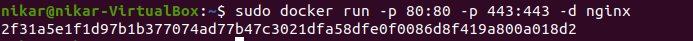
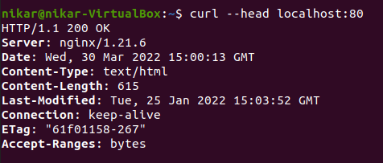
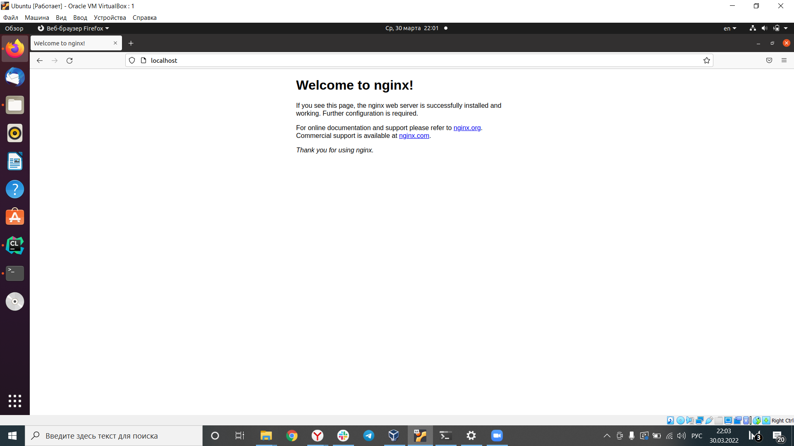

## Part 1. Готовый докер

- Взять официальный докер образ с nginx и выкачать его при помощи docker pull \
  
- Проверить наличие докер образа через docker images \
  
- Запустить докер образ через docker run -d [image_id|repository] \
  
- Проверить, что образ запустился через docker ps \
  
- Посмотреть информацию о контейнере через docker inspect [container_id|container_name] \
  
- По выводу команды определить и поместить в отчёт размер контейнера, список замапленных портов и ip контейнера\
  Размер: 142 MB\
  Порты: 80/tcp\
  IP: 172.17.0.2
- Остановить докер образ через docker stop [container_id|container_name] \
  
- Проверить, что образ остановился через docker ps \
  
- Запустить докер с замапленными портами 80 и 443 на локальную машину через команду run \
  
- Проверить, что в браузере по адресу localhost:80 доступна стартовая страница nginx \
  
  
- Перезапустить докер образ через docker restart [image_id|repository] \
  

## Part 2. Операции с контейнером

- Прочитать конфигурационный файл *nginx.conf* внутри докер образа через команду *exec* \
  

- Создать на локальной машине файл *nginx.conf*
- Настроить в нем по пути */status* отдачу страницы статуса сервера **nginx** \
  

- Скопировать созданный файл *nginx.conf* внутрь докер образа через команду `docker cp` \
  

- Перезапустить **nginx** внутри докер образа через команду *exec* \
  

- Проверить, что по адресу *localhost:80/status* отдается страничка со статусом сервера **nginx** \
  

- Экспортировать контейнер в файл *container.tar* через команду *export* \
  

- Остановить контейнер \
  

- Удалить образ через `docker rmi [image_id|repository]`, не удаляя перед этим контейнеры \
  

- Импортировать контейнер обратно через команду *import* \
  

- Запустить импортированный контейнер \
  

## Part 3. Мини веб-сервер

Папка `server` и файл `nginx/nginx.conf`
- docker pull nginx
- docker run --name part3 -p81:81 -d nginx
- docker exec part3 apt update -y
- docker exec part3 apt install -y gcc libfcgi-dev fcgiwrap
- docker cp nginx/nginx.conf part3:/etc/nginx/nginx.conf
- docker cp mini_serv.c part3:mini_serv.c
- docker exec part3 nginx -s reload
- docker exec part3 gcc mini_serv.c -o server -lfcgi
- docker exec part3 spawn-fcgi -p 8080 ./server

Если браузер не показыват адрес, проверить при помощи:
- docker exec part3 curl 127.0.0.1:81

## Part 4. Свой докер

Используется `Dockerfile_Part_4`, `nginx/nginx.conf` и папка `server`
- docker build -f ./Dockerfile_Part_4 -t dock:4 .
- docker run --name part4 -p 80:81 -v "*Path to src*"/nginx/nginx.conf:/etc/nginx/nginx.conf -dt dock:4
- Проверяем в браузере localhost:80
- Меняем nginx.conf, добавляя: "
  location /status {
  stub_status;
  }
  "
- docker restart part4
- Проверяем в браузере localhost:80/status

## Part 5. **Dockle**

Используется `Dockerfile_Part_5`.
- docker build -f ./Dockerfile_Part_5 -t dock:5 .

Для мака:
- brew install goodwithtech/r/dockle

Для убунты:
- VERSION=$(curl --silent "https://api.github.com/repos/goodwithtech/dockle/releases/latest" | grep '"tag_name":' | sed -E 's/.*"v([^"]+)".*/\1/')
- curl -L -o dockle.deb https://github.com/goodwithtech/dockle/releases/download/v${VERSION}/dockle_${VERSION}_Linux-64bit.deb
- sudo dpkg -i dockle.deb && rm dockle.deb"

- dockle dock:5 {sudo для убунты}

INFO не являются ошибками, вроде не обязательно исправлять

## Part 6. Базовый **Docker Compose**

Используется `docker-compose.yml`, папка `proxy` и `server`.
- docker-compose -p part6 build
- docker-compose -p part6 up
